# HTML5:标签

## 基本语法

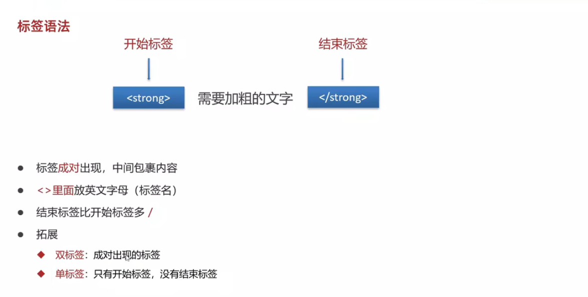

## 网页基本骨架

* 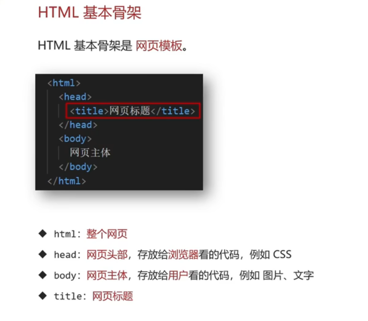
* 快捷键：先输入一个感叹号，然后按TAB或Enter
* 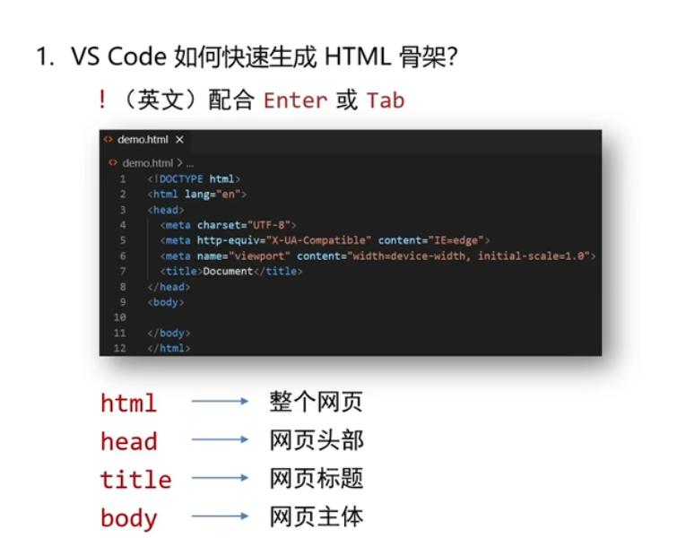

## 标签的父子级关系

* 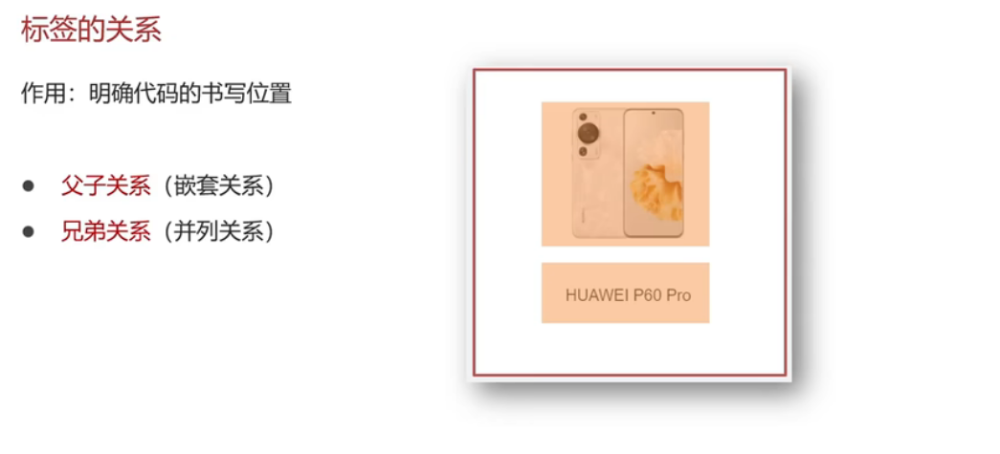
* 大标签里面嵌套图片，图片就是小标签

## HTML网页标题

### 标题标签

* 

### 段落标签

* 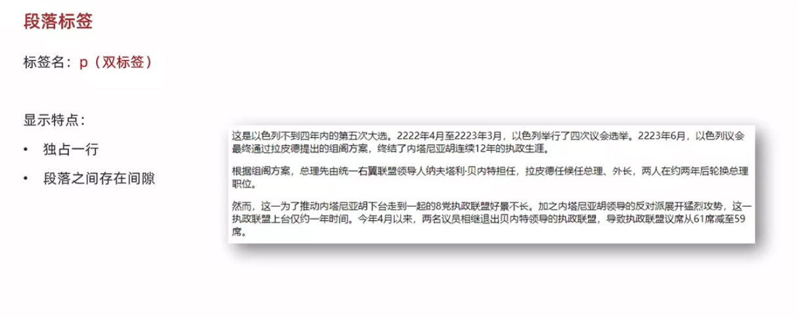

## 多种标签类型

### 换行和水平线标签

* 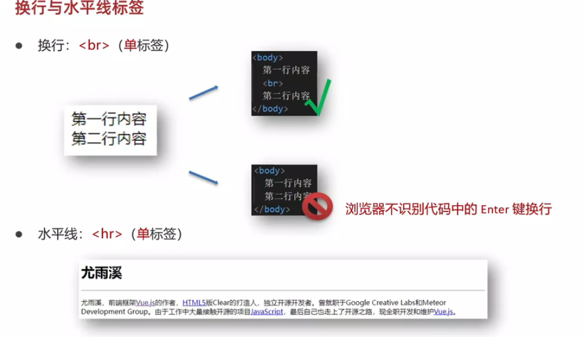

### 文本格式化标签

* 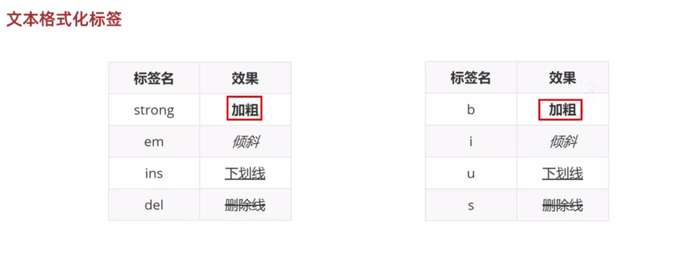

### 图像标签

* 
* 按下./之后可以浏览文件夹内的所有图片
* 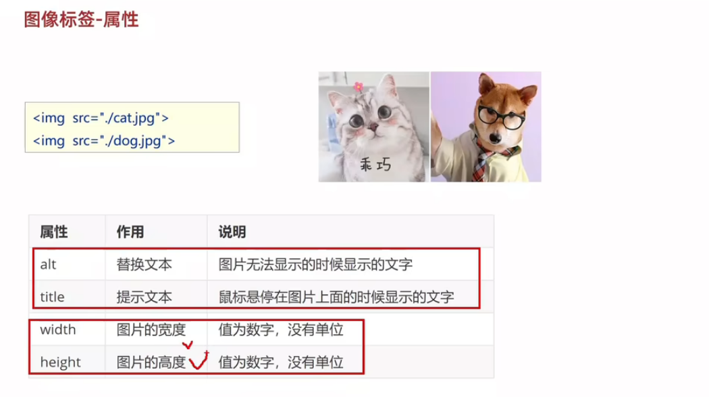
* 属性的写法：属性名 = "属性值"
* 注意图片标签里面的路径可以填相对路径也可以填绝对路径（不建议）
* 路径里面不要用中文

### 超链接标签

* 
* 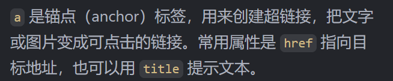
* 注意这个相对路径依旧可以用输入./的方法查找
* href后面的属性可以填#表示空链接

### 音视频标签

* 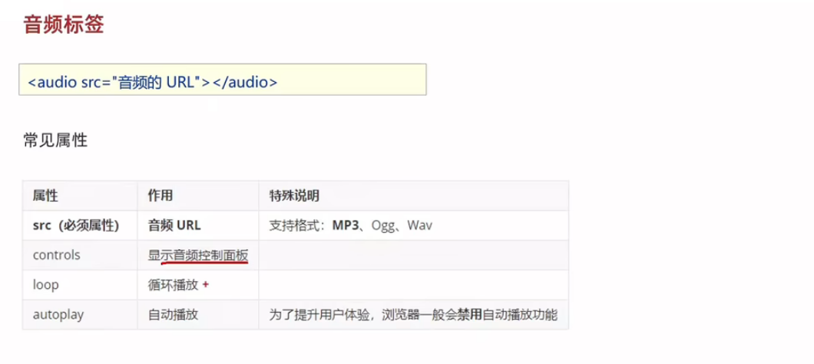
* 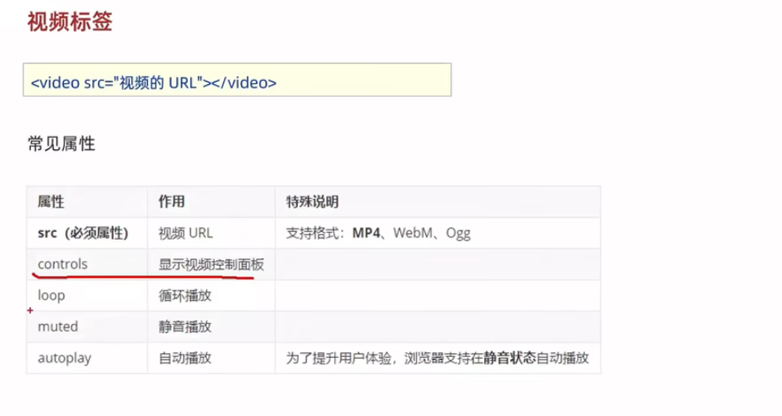
